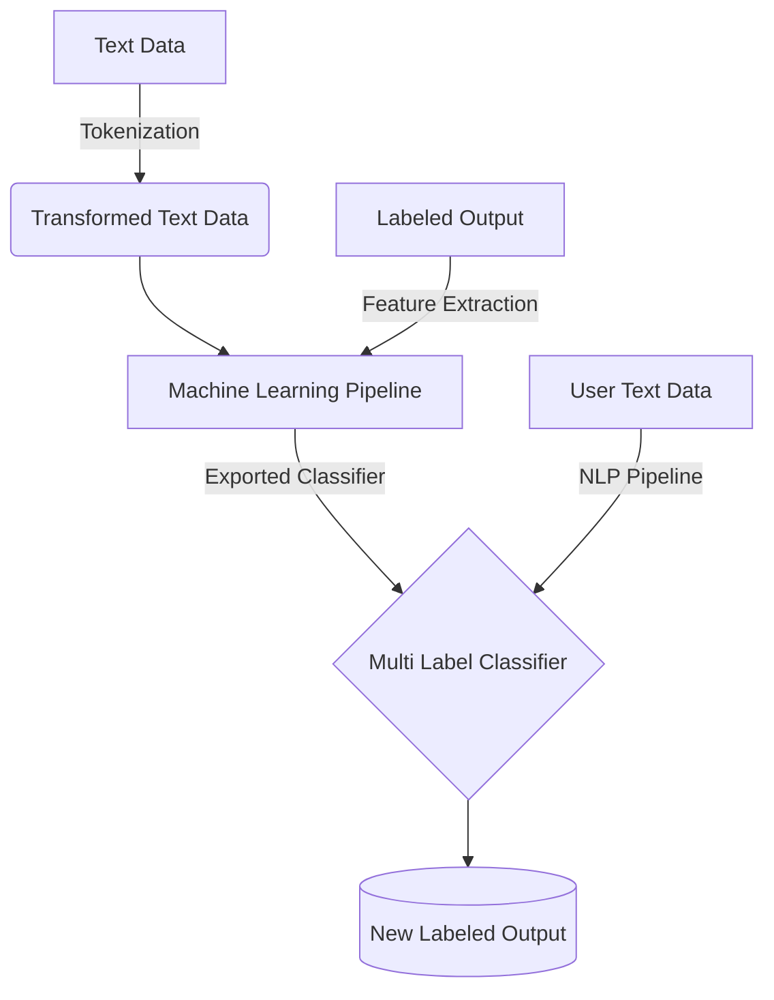

# Disaster Response Classification

### Table of Contents
---

+ [**Setup Instructions**](#instructions)
    + [**Project Flowchart**](#flowchart)
    + [**Motivation**](#motivation)
    + [**Project Structure**]
+ [**NLP Pipeline**](#nlp_pipeline)
    + [**Tokenization**](#tokenization)
+ [**ML Pipeline**](#ML_pipeline)
    + [**Multi-Label Classifier**](#classifier)

### Instructions:
1. Run the following commands in the project's root directory to set up your database and model.

    - To run ETL pipeline that cleans data and stores in database
        `python data/process_data.py data/disaster_messages.csv data/disaster_categories.csv data/DisasterResponse.db`
    - To run ML pipeline that trains classifier and saves
        `python models/train_classifier.py data/DisasterResponse.db models/classifier.pkl`

2. Go to `app` directory: `cd app`

3. Run your web app: `python run.py`

4. Click the `PREVIEW` button to open the homepage

#### Flowchart

#### ML pipeline
---
The machine learning script, train_classifier.py, runs in the terminal without errors. The script takes the database file path and model file path, creates and trains a classifier, and stores the classifier into a pickle file to the specified model file path.