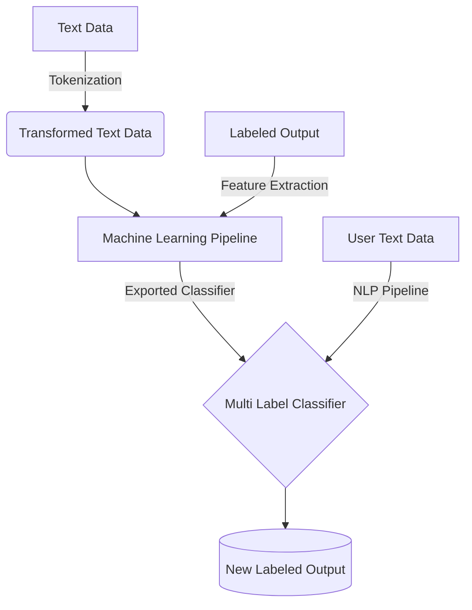

# Disaster Response Classification
In an emergency situation such as a diasaster, diasaster response workers may be flooded with new messages requesting aid. This web app is intended to classify these messages into several categories in order to help emergency workers response quicker!

### Table of Contents
---

+ [**Conclusion**](#conclusion)
+ [**Setup Instructions**](#instructions)
    + [**Flowchart**](#flowchart)
    + [**Motivation**](#motivation)
+ [**NLP Pipeline**](#nlp-pipeline)
    + [**Tokenization**](#tokenization)
+ [**ML Pipeline**](#mL-pipeline)
    + [**MultiOutputClassifier**](#multiOutputClassifier)

---

### Conclusion
---
#### The Dataset Challenges
The disaster response dataset is class imbalanced with several categories that have 5% and even 1% of the total samples in the dataset. As such the approach chosen is undersampling. In the context of the data this is an appropriate method to deal with imbalance since many of the text data are very similar but not exactly the same. However it is important to understand the trade off in using undersampling is we are losing a ton of data. Thus we are justifying this choice since most of the data is similar. _This approach improved **f1 score** by 0.33 from 0.51 to 0.84_. This is without even using **GridSearchCV** to optimize for hyperparameters.

#### Sampling
Some of the difficulities with this dataset stem from implementing the sampling since this is a **multi label classification** model. There are several categories that are are predicted. Thus SMOTE which artificially creates samples can not be implemented easily. Potentially can revisit this avenue of improvement and try to implement a custom SMOTE transformer for the ML pipeline.

#### Feature Engineering (Trade offs)
We can improve the performance of the model even further through feature engineering. The idea is to merge some of the small sample target features into the larger ones. The larger target features are typically more general and so it can make sense to do this. This improves f1 score to 0.93 improving by 0.09 however its important to consider that we are trading off the ability of our model to predict very specific types of diasasters. This may not be acceptable since there might be specialized gear that disaster teams may need to being with them before hand to deal with the situation. Therefore they may need that information of what the exact situation is. However if that information isn't needed and it is okay to have the general category then it may be okay to do this feature merging.


Undersampling, With Feature Engineering, Without GridSearchCV

(Left to right: Precision Score, Recall Score, F1 Score, # of Samples)

#### Model Results
There are three models that was tested **DecisionTreeClassifier**, **Random Forest Classifier**, **AdaBoostClassifier**. The Random Forest Classifier out performed in our evaluation metrics relative to the other two as expected since it is an ensemble method. 

Through a combination of **undersampling**, **tokenization**, **tdifTransformer** and **feature engineering** the model improved in _precision_, _recall_ and _f1-score_. 

##### **Random Forest**


Undersampling, Without Feature Engineering, Without GridSearchCV


Undersampling, Without Feature Engineering, With GridSearchCV


##### **Decision Tree**


Undersampling, Without Feature Engineering, Without GridSearchCV


##### **AdaBoostClassifier**


Undersampling, Without Feature Engineering, Without GridSearchCV


### Instructions
___
1. Run the following commands in the project's root directory to set up your database and model.

    - To run ETL pipeline that cleans data and stores in database
        `python data/process_data.py data/disaster_messages.csv data/disaster_categories.csv data/DisasterResponse.db`
    - To run ML pipeline that trains classifier and saves
        `python models/train_classifier.py data/DisasterResponse.db models/classifier.pkl`

2. Go to `app` directory: `cd app`

3. Run your web app: `python run.py`

4. Go to http://127.0.0.1:3000 to view the homepage

#### Flowchart
---

#### Motivation
---
In an emergency situation such as a diasaster, diasaster response workers may be flooded with new messages requesting aid. This web app is intended to classify these messages into several categories in order to help emergency workers response quicker!

As such this project utilizes both a [NLP pipeline](#nlp-pipeline) as we are dealing with text data and a [ML pipeline](#ml-pipeline) to optimize our classifier. 

---
### NLP pipeline
---
process_data.py, write a data cleaning pipeline that:

    Loads the messages and categories datasets
    Merges the two datasets
    Cleans the data
    Stores it in a SQLite database


#### Tokenization
---

For the text message data we need to handle capitalization, punctuation, steming and also removing stop words, before we use TfidfTransformer.

```python
def tokenize(text):
    
    clean_tokens = []
    
    # lowercasing and removing punctuation
    text = re.sub(r"[^a-zA-Z0-9]", " ", text.lower().strip())
    tokens = word_tokenize(text)
    # Remove stop words + stem
    stemmer = PorterStemmer()
    
    
    stop_words = stopwords.words("english")
    clean_tokens = [ stemmer.stem(word) for word in tokens if word not in stop_words]

    return clean_tokens
```
### ML pipeline
---
train_classifier.py, write a machine learning pipeline that:

    Loads data from the SQLite database
    Splits the dataset into training and test sets
    Builds a text processing and machine learning pipeline
    Trains and tunes a model using GridSearchCV
    Outputs results on the test set
    Exports the final model as a pickle file


#### MultiOutputClassifier
---

As mentioned since the model that is developed involves predicting potentially 36 categories and most classifiers only one target feature. Multi Output Classifier is used to use typical classifiers that don't natively support multi-target classification.
