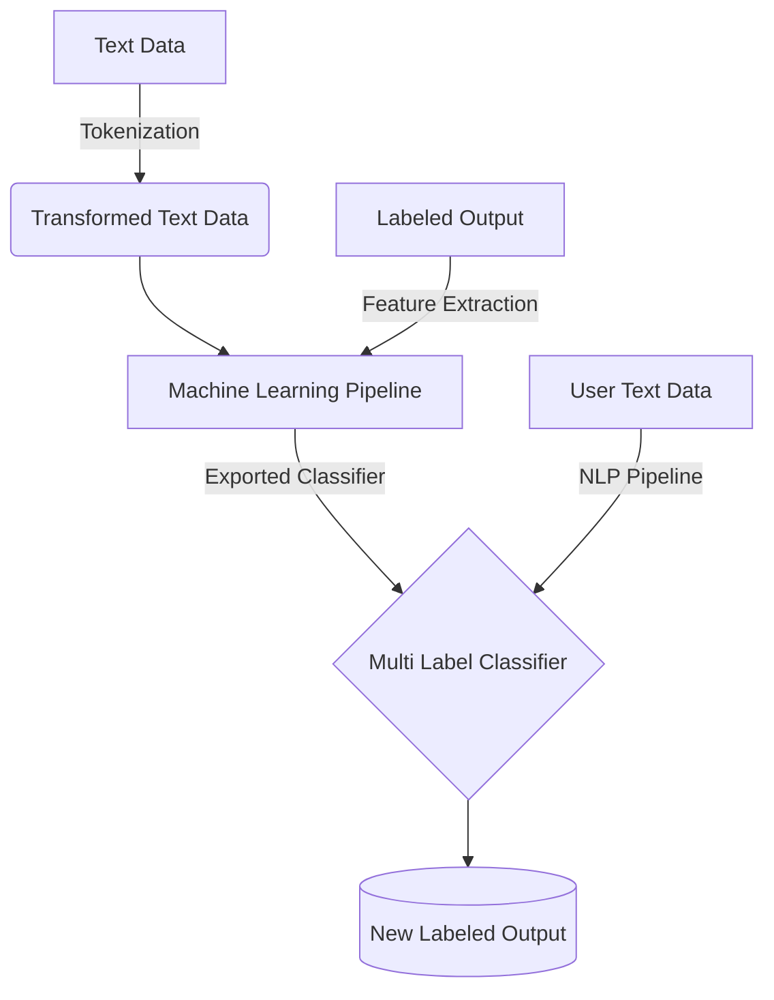

# Disaster Response Classification
In an emergency situation such as a diasaster, diasaster response workers may be flooded with new messages requesting aid. This web app is intended to classify these messages into several categories in order to help emergency workers response quicker!

### Conclusion
The disaster response dataset is class imbalanced with several categories that have 5% and even 1% of the total samples in the dataset. As such the approach chosen is undersampling. In the context of the data this is an appropriate method to deal with imbalance since many of the text data are very similar but not exactly the same. However it is important to understand the trade off in using undersampling is we are losing a ton of data. This approach improved f1 score by 0.33.

Some of the difficulities with this dataset stem from implementing the sampling since this is a multi label classification model. There are several categories that is being predicted with one category that has no samples which was dropped. Thus SMOTE which artificially creates samples can not be implemented easily. Potentially can revisit this avenue of improvement and try to implement a custom SMOTE transformer for the ML pipeline.

There are three models that was tested DecisionTreeClassifier, Random Forest Classifier, AdaBoostClassifier. THe Random Forest Classifier out performed in our evaluation metrics relative to the other two as expected since it is an ensemble method.
### Table of Contents
---
+ [**Conclusion**](#conclusion)
+ [**Setup Instructions**](#instructions)
    + [**Flowchart**](#flowchart)
    + [**Motivation**](#motivation)
+ [**NLP Pipeline**](#nlp-pipeline)
    + [**Tokenization**](#tokenization)
+ [**ML Pipeline**](#ML-pipeline)
    + [**MultiOutputClassifier**](#classifier)
---
### Instructions
___
1. Run the following commands in the project's root directory to set up your database and model.

    - To run ETL pipeline that cleans data and stores in database
        `python data/process_data.py data/disaster_messages.csv data/disaster_categories.csv data/DisasterResponse.db`
    - To run ML pipeline that trains classifier and saves
        `python models/train_classifier.py data/DisasterResponse.db models/classifier.pkl`

2. Go to `app` directory: `cd app`

3. Run your web app: `python run.py`

4. Click the `PREVIEW` button to open the homepage

#### Flowchart
---

#### Motivation
---
In an emergency situation such as a diasaster, diasaster response workers may be flooded with new messages requesting aid. This web app is intended to classify these messages into several categories in order to help emergency workers response quicker!

As such this project utilizes both a [NLP pipeline](#nlp-pipeline) as we are dealing with text data and a [ML pipeline](#ml-pipeline) to optimize our classifier. 

---
### NLP pipeline
---
process_data.py, write a data cleaning pipeline that:

    Loads the messages and categories datasets
    Merges the two datasets
    Cleans the data
    Stores it in a SQLite database

#### Tokenization
---
### ML pipeline
---
train_classifier.py, write a machine learning pipeline that:

    Loads data from the SQLite database
    Splits the dataset into training and test sets
    Builds a text processing and machine learning pipeline
    Trains and tunes a model using GridSearchCV
    Outputs results on the test set
    Exports the final model as a pickle file

#### MultiOutputClassifier
---